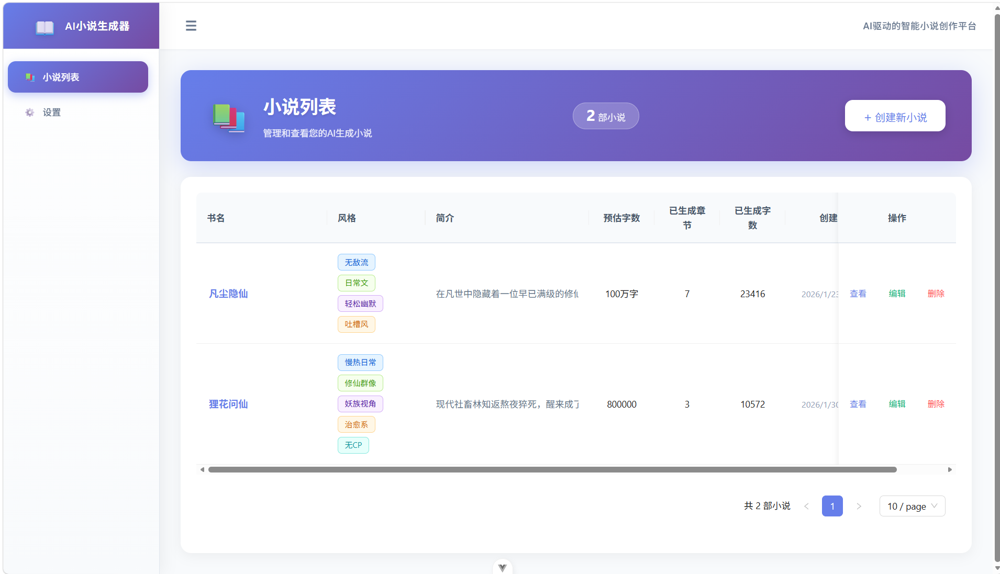

# NovelAI - AI小说创作助手

一个基于 Vue 3 + AI 的智能小说创作工具，帮助作者快速生成小说概览、章节内容，并提供完整的创作管理功能。


## 🌐 在线体验

> **Vercel 部署**：https://novelai-rosy.vercel.app/
>
> *注：可能需要科学上网才能访问*

---

> **核心特点**：
> - 🚀 **纯前端架构** - 所有数据存储在浏览器 IndexedDB 中，无需后端服务
> - 🤖 **多模型支持** - 支持 Kimi、通义千问等多种 AI 模型
> - 📝 **完整创作流程** - 从灵感到大纲到章节的完整小说创作支持
> - 🎯 **智能上下文** - 自动管理角色状态、伏笔追踪，确保章节连贯性
> - ✨ **写作工具集** - 灵感工坊、修辞助手、敏感词检测等辅助工具

---

## 📸 界面预览


*小说管理界面*


*大纲编辑器*


*章节生成界面*


*写作工具集*

---

## ✨ 功能特性

### 📝 智能创作

#### 小说概览生成
- **一键生成** - 输入灵感，AI 自动生成完整小说设定
- **分步生成** - 分三步生成（基础设定 → 角色设定 → 剧情大纲），每步可单独调整
- **生成内容** - 书名、简介、风格标签、世界观、角色设定、主线/支线剧情、分卷大纲

#### 章节智能生成
- **上下文感知** - AI 根据小说概览、最近章节、章节总结生成连贯内容
- **大纲预生成** - 先生成章节大纲，确认后再生成正文，提高可控性
- **流式输出** - 实时显示生成进度，支持中断续写
- **智能批量生成** - 根据章节位置自动选择生成策略（开篇/发展/高潮/过渡）
- **断点续写** - 支持从上次中断处继续生成

#### 内容质量控制
- **质量检测** - 自动检测字数、重复率、敏感词、逻辑一致性
- **连贯性评分** - 评估章节与上下文的连贯程度
- **负面提示词** - 避免网络用语、逻辑矛盾等问题
- **风格适配** - 根据小说风格（玄幻、仙侠、都市等）自动调整写作规范

### 📚 创作管理

#### 小说管理
- 创建、编辑、删除小说
- 查看创作进度和字数统计
- 导出为 TXT 文件
- 批量重命名章节

#### 章节管理
- 章节增删改查
- 批量生成章节
- 章节内容编辑和重新生成
- 章节排序和重新编号
- 多版本内容对比

#### 角色与剧情管理
- **角色卡片系统** - 管理角色信息、状态、关系
- **关系图谱** - 可视化展示角色间关系
- **伏笔管理** - 追踪伏笔埋设和回收状态
- **时间线事件** - 记录重要事件确保剧情连贯
- **冲突检测** - 识别剧情中的逻辑冲突

#### 大纲编辑
- **分卷大纲** - 可视化编辑分卷结构
- **剧情线管理** - 主线、支线剧情规划
- **章节规划** - 拖拽式章节规划工具

### 🎨 写作工具

#### 灵感工坊
- 随机生成创意灵感
- 智能灵感增强和扩展
- 灵感收藏和管理

#### 修辞助手
- 修辞手法分析和建议
- 文章润色和优化建议
- 风格调整工具

#### 敏感词检测
- 实时敏感词检测
- 自定义敏感词库
- 一键替换建议

#### 数据统计
- 实时字数统计
- 生成历史记录
- 创作数据分析

### 🖥️ 用户体验

- **现代化界面** - 基于 Ant Design Vue 的美观界面
- **响应式设计** - 适配各种屏幕尺寸
- **实时预览** - 章节内容实时编辑预览
- **进度追踪** - 实时显示创作进度和字数统计
- **生成任务队列** - 管理批量生成任务，支持暂停/继续
- **阅读器模式** - 沉浸式阅读体验，支持自定义字体和主题

---

## 🚀 技术栈

| 类别 | 技术 |
|------|------|
| 前端框架 | Vue 3.5 + Composition API + `<script setup>` |
| 状态管理 | Pinia 3.0 |
| UI 组件库 | Ant Design Vue 4 |
| 路由管理 | Vue Router 4 |
| 本地数据库 | Dexie.js (IndexedDB 封装) |
| HTTP 客户端 | Axios |
| 可视化 | vis-network (关系图谱) |
| 构建工具 | Vite 6 |
| 代码规范 | Prettier 3 |

---

## 📦 安装使用

### 环境要求

- Node.js >= 18.0.0
- npm >= 9.0.0

### 安装步骤

1. **克隆项目**

```bash
git clone https://github.com/yourusername/novel-ai.git
cd novel-ai
```

2. **安装依赖**

```bash
npm install
```

3. **配置 API Key**

   在设置页面配置 AI 提供商的 API Key 和模型名称

4. **启动开发服务器**

```bash
npm run dev
```

5. **构建生产版本**

```bash
npm run build
```

---

## 🔧 配置说明

### AI 提供商配置

项目支持以下 AI 提供商：

| 提供商 | 官网 | 模型示例 |
|--------|------|----------|
| Kimi | [platform.moonshot.cn](https://platform.moonshot.cn/) | kimi-k2-turbo-preview |
| 通义千问 | [dashscope.aliyuncs.com](https://dashscope.aliyuncs.com/) | qwen3-max |

### 配置步骤

1. 选择 AI 提供商
2. 输入对应的 API Key
3. 自定义模型名称（可选）
4. 设置请求超时时间

---

## 📖 使用指南

### 创建小说

1. 点击「创建新小说」
2. 选择生成模式：
   - **一键生成**：输入灵感，直接生成完整概览
   - **分步生成**：分三步生成，每步可调整
3. 审阅并确认生成结果

### 编辑大纲

1. 进入「大纲编辑」页面
2. 查看和编辑分卷结构
3. 管理剧情线和章节规划
4. 使用冲突检测工具检查剧情逻辑

### 生成章节

1. 进入小说详情页或章节生成页面
2. 点击「生成章节」
3. 配置生成参数：
   - 章节数量
   - 字数范围
   - 是否启用大纲预生成
4. AI 根据上下文生成连贯章节
5. 审阅、编辑并保存

### 批量生成

1. 在章节生成页面选择多章节模式
2. 设置起始章节和数量
3. 系统自动分配生成策略
4. 可在任务队列中查看进度

### 使用写作工具

1. **灵感工坊** - 访问「灵感工坊」获取创意灵感
2. **修辞助手** - 在写作工具页面分析文本修辞
3. **敏感词检测** - 使用敏感词工具检查内容合规性

### 阅读模式

1. 进入「阅读模式」查看已生成章节
2. 自定义阅读设置（字体、主题等）
3. 使用章节导航快速跳转

---

## 🏗️ 项目结构

```
src/
├── assets/                    # 静态资源
│   ├── base.css              # 基础样式
│   ├── main.css              # 主样式
│   └── variables.css         # CSS 变量
├── components/               # Vue 组件
│   ├── chapter/              # 章节相关组件
│   │   ├── ChapterList.vue
│   │   └── StreamOutput.vue
│   ├── character/            # 角色相关组件
│   │   └── RelationshipGraph.vue
│   ├── common/               # 通用组件
│   │   ├── EmptyState.vue
│   │   └── PageHeader.vue
│   ├── novel/                # 小说相关组件
│   │   ├── NovelForm.vue
│   │   └── NovelInfo.vue
│   ├── outline/              # 大纲相关组件
│   │   ├── ChapterPlanner.vue
│   │   ├── ConflictDetector.vue
│   │   ├── PlotLineView.vue
│   │   └── TimelineEditor.vue
│   └── reader/               # 阅读器组件
│       ├── ChapterNav.vue
│       └── ReaderSettings.vue
├── composables/              # 组合式函数
│   ├── useAI.js              # AI 调用封装
│   ├── useBatchRename.js     # 批量重命名
│   ├── useChapter.js         # 章节管理
│   ├── useCharacter.js       # 角色管理
│   ├── useCharacterRelation.js # 角色关系
│   ├── useCoherenceScore.js  # 连贯性评分
│   ├── useForeshadowing.js   # 伏笔管理
│   ├── useGenerationQueue.js # 生成队列管理
│   ├── useInspiration.js     # 灵感管理
│   ├── useMultiVersion.js    # 多版本管理
│   ├── useNovel.js           # 小说管理
│   ├── useOutline.js         # 大纲管理
│   ├── usePlotBranch.js      # 剧情分支
│   ├── useQualityCheck.js    # 质量检测
│   ├── useReader.js          # 阅读器设置
│   ├── useResumeGeneration.js # 断点续写
│   ├── useRhetoricAssistant.js # 修辞助手
│   ├── useSensitiveWords.js  # 敏感词检测
│   ├── useStructuredSummary.js # 结构化总结
│   └── useWordStats.js       # 字数统计
├── router/                   # 路由配置
│   └── index.js
├── stores/                   # Pinia 状态管理
│   └── app.js
├── utils/                    # 工具函数
│   ├── api.js                # AI API 封装
│   ├── batchGenerator.js     # 批量生成器
│   ├── contentExpander.js    # 内容扩展
│   ├── contextBuilder.js     # 上下文构建
│   ├── dao.js                # 数据访问对象
│   ├── db.js                 # IndexedDB 配置
│   ├── dynamicPrompt.js      # 动态 Prompt 构建
│   ├── inspirationEnhancer.js # 灵感增强
│   ├── prompts.js            # AI 提示词模板
│   ├── sceneTemplates.js     # 场景模板
│   └── worldTemplates.js     # 世界观模板
├── views/                    # 页面视图
│   ├── ChapterCreate.vue     # 生成章节
│   ├── ChapterDetail.vue     # 章节详情
│   ├── InspirationWorkshop.vue # 灵感工坊
│   ├── NovelCreate.vue       # 创建小说
│   ├── NovelDetail.vue       # 小说详情
│   ├── NovelEdit.vue         # 编辑小说
│   ├── NovelList.vue         # 小说列表
│   ├── NovelReader.vue       # 阅读模式
│   ├── OutlineEditor.vue     # 大纲编辑
│   ├── Settings.vue          # 设置页面
│   └── WritingTools.vue      # 写作工具
├── App.vue                   # 根组件
└── main.js                   # 入口文件
```

---

## 📊 数据模型

### 小说 (Novel)
```javascript
{
  id: Number,
  title: String,              // 书名
  description: String,        // 简介
  style: [String],            // 风格标签
  worldSetting: Object,       // 世界观设定
  characters: Object,         // 角色设定
  plotLines: Object,          // 剧情线
  outline: [Object],          // 分卷大纲
  createdAt: Date,
  updatedAt: Date
}
```

### 章节 (Chapter)
```javascript
{
  id: Number,
  novelId: Number,
  chapterNumber: Number,
  title: String,
  content: String,
  summary: String,            // 章节摘要
  wordCount: Number,
  createdAt: Date,
  updatedAt: Date
}
```

### 角色 (Character)
```javascript
{
  id: Number,
  novelId: Number,
  name: String,
  type: 'protagonist' | 'supporting' | 'antagonist' | 'minor',
  basicInfo: Object,          // 基本信息
  currentStatus: Object,      // 当前状态
  relationships: [Object],    // 角色关系
  appearances: [Object]       // 出场记录
}
```

### 伏笔 (Foreshadowing)
```javascript
{
  id: Number,
  novelId: Number,
  type: 'planted' | 'resolved',
  content: String,
  importance: 'high' | 'medium' | 'low',
  status: 'pending' | 'resolved',
  relatedCharacters: [Number]
}
```

---

## 🔒 隐私说明

- ✅ 所有数据存储在浏览器本地（IndexedDB）
- ✅ API Key 仅保存在本地，不会上传到任何服务器
- ✅ 支持随时清除所有本地数据
- ✅ 无后端服务，数据完全由用户掌控

---

## 🗺️ 开发路线

### 已实现 ✅

- [x] 小说概览生成（一键/分步）
- [x] 章节智能生成
- [x] 上下文优化（角色状态追踪）
- [x] 章节大纲预生成
- [x] 生成任务队列
- [x] 动态 Prompt 构建
- [x] 负面提示词系统
- [x] 智能批量生成
- [x] 生成后质量检测
- [x] 连贯性评分系统
- [x] 角色卡片系统
- [x] 角色关系图谱
- [x] 伏笔管理
- [x] 时间线编辑器
- [x] 冲突检测
- [x] 灵感工坊
- [x] 修辞助手
- [x] 敏感词检测
- [x] 多版本生成对比
- [x] 断点续写
- [x] 阅读器模式
- [x] 批量重命名
- [x] 结构化摘要

### 进行中 🚧

- [ ] 剧情分支管理 UI 完善
- [ ] 写作风格学习
- [ ] 更多 AI 提供商支持

### 计划中 📋

- [ ] 云端同步功能
- [ ] 协作写作支持
- [ ] AI 对话式编辑
- [ ] 更多导出格式（EPUB、PDF）
- [ ] 主题市场
- [ ] 模板库扩展

---

## 🤝 贡献指南

欢迎提交 Issue 和 Pull Request！

1. Fork 本项目
2. 创建特性分支 (`git checkout -b feature/AmazingFeature`)
3. 提交更改 (`git commit -m 'Add some AmazingFeature'`)
4. 推送分支 (`git push origin feature/AmazingFeature`)
5. 创建 Pull Request

### 代码规范

- 使用 Composition API + `<script setup>` 语法
- 组件名使用 PascalCase
- 组合式函数使用 `use` 前缀
- 保持代码简洁，注重可读性

---

## 📄 开源协议

本项目基于 [MIT](LICENSE) 协议开源。

---

## 🙏 致谢

- [Vue.js](https://vuejs.org/)
- [Ant Design Vue](https://www.antdv.com/)
- [Vite](https://vitejs.dev/)
- [Dexie.js](https://dexie.org/)
- [Pinia](https://pinia.vuejs.org/)
- [vis.js](https://visjs.org/)

---

## 📮 联系方式

如有问题或建议，欢迎通过以下方式联系：

- 提交 [Issue](https://github.com/yourusername/novel-ai/issues)
- 发送邮件至 your-email@example.com

---

**注意**：本项目仅供学习和创作使用，请遵守相关 AI 服务的使用条款。
