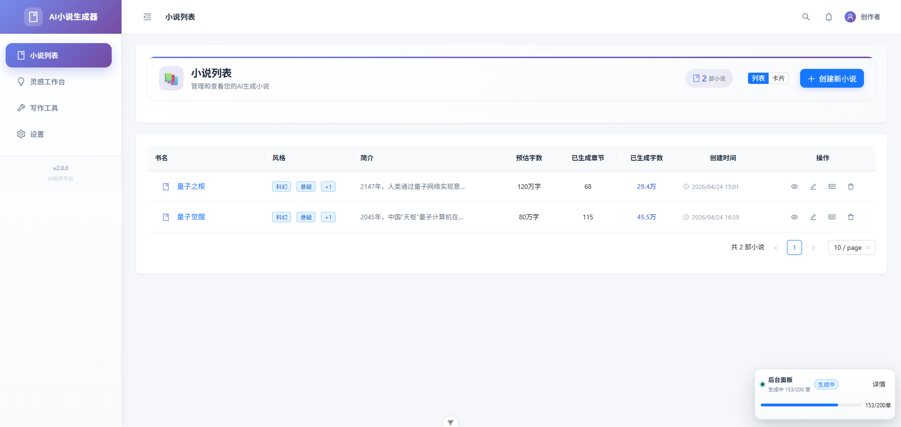
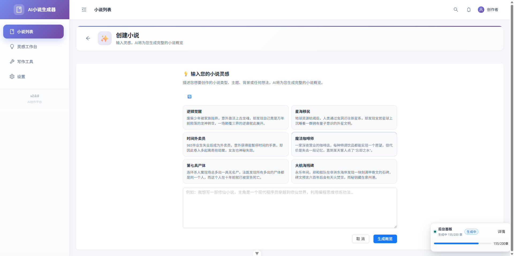
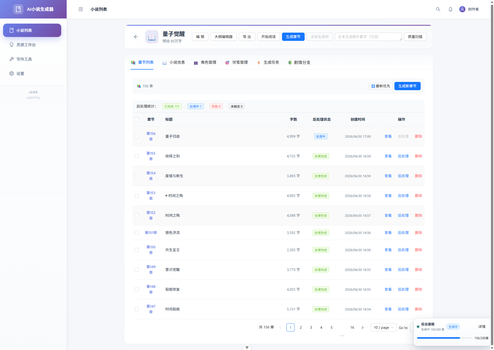
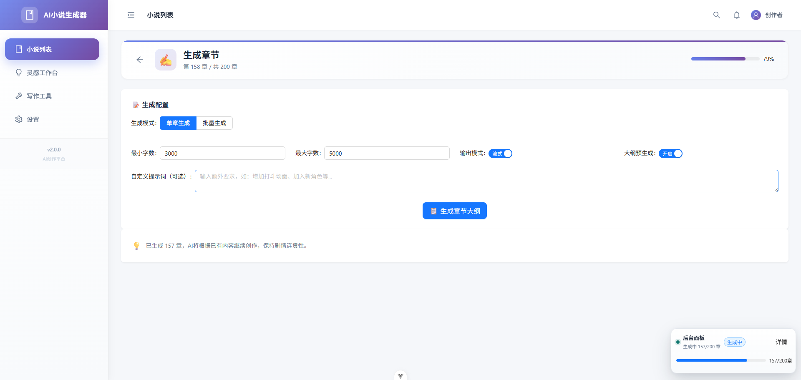
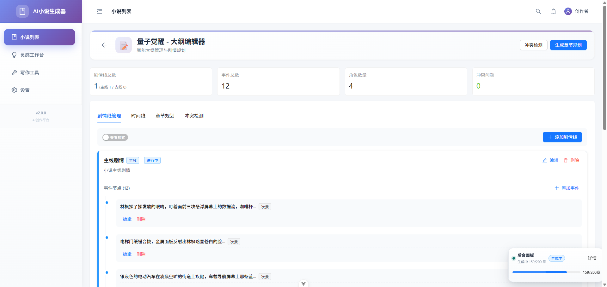
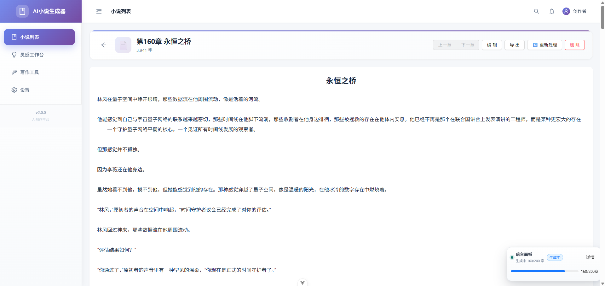
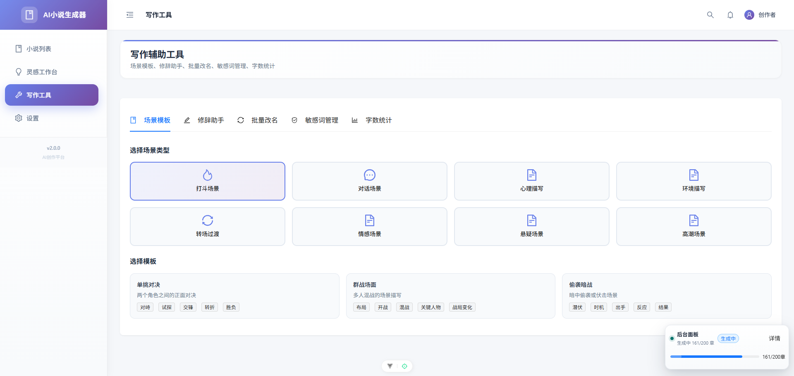
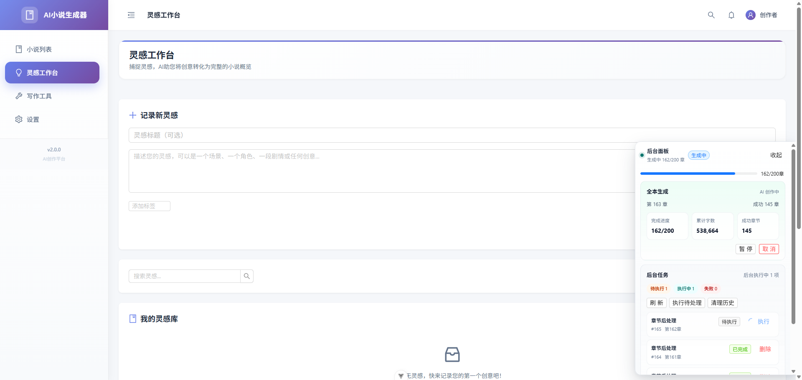

# NovelAI

一个基于 Vue 3 的 AI 小说创作助手，覆盖从灵感生成、小说设定、章节创作，到角色、伏笔、时间线、阅读与质量检查的完整写作流程。


## 在线体验

体验地址：

[https://novelai-rosy.vercel.app/](https://novelai-rosy.vercel.app/)

> 提示：当前体验地址通常需要科学上网后才能正常访问。

## 项目简介

NovelAI 面向小说作者与长篇创作场景，目标不是只生成一段文本，而是帮助你管理整部作品的创作过程。

它提供了：

- AI 辅助小说概览生成
- 章节生成与续写
- 全本一键生成
- 角色、关系、伏笔、时间线管理
- 本地数据持久化
- 阅读器与创作质量检查
- 后台任务面板与后处理能力

项目采用纯前端架构，主要数据保存在浏览器本地 IndexedDB 中，适合本地创作、快速验证和个人写作工作流。

## 功能特性

### 1. 小说创建与概览生成

- 输入灵感后自动生成书名、简介、世界观、角色设定、主线支线与章节结构
- 支持保存小说并继续进入章节创作
- 支持“保存并一键生成全本”

### 2. 章节创作

- 单章 AI 生成
- 上下文感知生成
- 章节摘要生成
- 最近章节、角色状态、伏笔信息联动参与生成

### 3. 全本生成

- 基于章节结构批量生成整本小说
- 支持后台执行
- 支持任务面板进度展示
- 支持刷新后恢复任务与进度展示

### 4. 创作资产管理

- 角色管理
- 角色关系图谱
- 伏笔埋设与回收跟踪
- 时间线事件记录
- 大纲编辑

### 5. 阅读与检查

- 阅读器模式
- 全本质量扫描
- 字数、连贯性、伏笔等维度检查

### 6. 本地化与数据存储

- 基于 IndexedDB 持久化数据
- 无需后端即可运行主流程
- API Key 与业务数据保存在本地

## 页面预览

### 首页 / 小说列表



> 小说列表、顶部导航、创建入口

### 创建小说



> 灵感输入、AI 生成概览、保存并生成全本入口

### 小说详情



> 章节列表、角色/伏笔/任务区域

### 章节生成



> 章节生成参数、生成结果、后处理状态

### 大纲编辑



> 主线支线、章节规划、剧情结构

### 阅读器



> 正文阅读、章节切换、阅读设置

### 写作工具



> 灵感工坊、质量扫描、辅助工具页面

### 后台任务面板



> 全本生成进度、章节后处理任务、状态恢复

## 技术栈

| 分类 | 技术 |
|---|---|
| 前端框架 | Vue 3 |
| 构建工具 | Vite |
| 状态管理 | Pinia |
| UI 组件库 | Ant Design Vue |
| 路由 | Vue Router |
| 本地数据库 | Dexie / IndexedDB |
| 请求库 | Axios |
| 图谱展示 | vis-network / vis-data |
| 代码格式化 | Prettier |

## 路由页面

当前项目主要页面包括：

- `/` 小说列表
- `/novel/create` 创建小说
- `/novel/:id` 小说详情
- `/novel/:id/edit` 编辑小说
- `/novel/:id/chapter/create` 章节生成
- `/novel/:id/chapter/:num` 章节详情
- `/novel/:id/outline` 大纲编辑
- `/reader/:id` 阅读器
- `/inspiration` 灵感工坊
- `/tools` 写作工具
- `/settings` 设置页

## 安装与启动

### 环境要求

- Node.js 18+
- npm 9+

### 安装依赖

```bash
npm install
```

### 启动开发环境

```bash
npm run dev
```

默认会启动 Vite 本地开发服务。

### 代码格式化

```bash
npm run format
```

## AI 配置说明

项目依赖外部 AI 接口完成小说概览生成、章节生成、结构化摘要等功能。

使用前请先在设置页面配置：

- AI 提供商
- API Key
- 模型名称

如果未配置 API Key，涉及 AI 的主流程将无法执行。

## 数据存储说明

项目采用浏览器本地存储方案：

- 小说数据：IndexedDB
- 角色、伏笔、时间线、任务数据：IndexedDB
- 本地创作状态：浏览器环境内保存

这意味着：

- 不依赖后端数据库即可体验主流程
- 更适合本地写作和测试环境
- 更换浏览器或清空浏览器数据后，本地数据可能丢失

## 项目结构

```text
src/
├─ components/              # 组件
│  ├─ chapter/              # 章节相关组件
│  ├─ character/            # 角色相关组件
│  ├─ common/               # 通用组件
│  ├─ novel/                # 小说相关组件
│  ├─ outline/              # 大纲相关组件
│  └─ reader/               # 阅读器相关组件
├─ composables/             # 组合式逻辑
├─ router/                  # 路由配置
├─ stores/                  # Pinia 状态
├─ utils/                   # 工具函数与数据访问层
└─ views/                   # 页面
```

## 当前适合的使用场景

- AI 小说创作原型工具
- 本地个人写作工作台
- 长篇小说章节生成与整理
- 角色、伏笔、时间线的辅助管理
