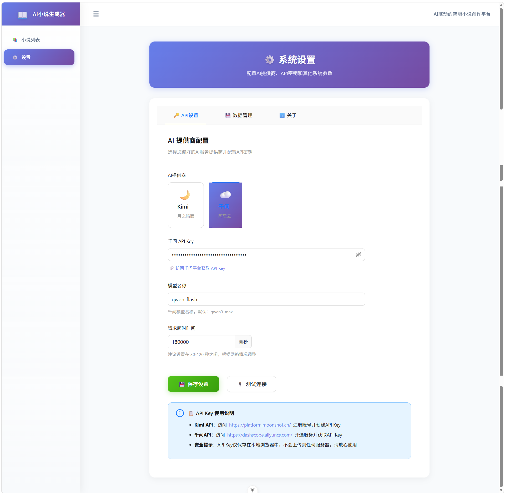

# NovelAI - AI小说创作助手

一个基于 Vue 3 + AI 的智能小说创作工具，帮助作者快速生成小说概览、章节内容，并提供完整的创作管理功能。
本项目没有后端，没有使用任何数据库，所有数据都存储在浏览器的 IndexedDB 中。
本项目使用Trea开发，全程使用AI开发。可能存在部分功能不完善，欢迎反馈和贡献。

## 体验地址

好像需要魔法才能打开。
vercel部署：https://novelai-rosy.vercel.app/

## ✨ 功能特性

### 📝 智能创作

- **小说概览生成**：根据灵感自动生成完整的小说设定（书名、简介、风格、主线/支线剧情、分卷大纲）
- **章节智能生成**：AI 根据小说概览、最近章节内容和章节总结，自动生成连贯的新章节
- **内容续写与改写**：支持对已有章节进行续写、改写、重新生成等操作
- **多模型支持**：支持 Kimi、通义千问等多个 AI 模型，可自定义模型参数

### 📚 创作管理

- **小说管理**：创建、编辑、删除小说，查看创作进度
- **章节管理**：章节增删改查，支持批量生成章节
- **数据持久化**：使用 IndexedDB 本地存储，数据安全可靠
- **导出功能**：支持导出章节内容为 TXT 文件

### 🎨 用户体验

- **现代化界面**：基于 Ant Design Vue 的美观界面
- **响应式设计**：适配各种屏幕尺寸
- **实时预览**：章节内容实时编辑预览
- **进度追踪**：实时显示创作进度和字数统计

## 🚀 技术栈

- **前端框架**：Vue 3 + Composition API
- **状态管理**：Pinia
- **UI 组件库**：Ant Design Vue 4
- **路由管理**：Vue Router 4
- **本地数据库**：Dexie.js (IndexedDB)
- **HTTP 客户端**：Axios
- **构建工具**：Vite

## 📦 安装使用

### 环境要求

- Node.js >= 18.0.0
- npm >= 9.0.0

### 安装步骤

1. 克隆项目

```bash
git clone https://github.com/yourusername/novelai.git
cd novelai
```

2. 安装依赖

```bash
npm install
```

3. 配置 API Key 和模型名称

   - 在设置页面配置 AI 提供商的 API Key 和模型名称
   - 支持 Kimi (Moonshot) 和通义千问 (阿里云)

4. 启动开发服务器

```bash
npm run dev
```

5. 构建生产版本

```bash
npm run build
```

## 🔧 配置说明

### AI 提供商配置

项目支持以下 AI 提供商：

| 提供商   | 官网                                                      | 模型示例              |
| -------- | --------------------------------------------------------- | --------------------- |
| Kimi     | [platform.moonshot.cn](https://platform.moonshot.cn/)     | kimi-k2-turbo-preview |
| 通义千问 | [dashscope.aliyuncs.com](https://dashscope.aliyuncs.com/) | qwen3-max             |

在设置页面中：

1. 选择 AI 提供商
2. 输入对应的 API Key
3. 自定义模型名称（可选）
4. 设置请求超时时间

## 📖 使用指南

### 创建小说

1. 点击"创建新小说"
2. 输入创作灵感或主题
3. AI 自动生成小说概览
4. 审阅并确认生成结果

### 生成章节

1. 进入小说详情页
2. 点击"生成章节"
3. 配置生成参数（章节数量、字数范围等）
4. AI 根据上下文生成连贯章节
5. 审阅、编辑并保存

### 管理章节

- 查看章节详情和字数统计
- 编辑章节内容
- 重新生成不满意的内容
- 导出为 TXT 文件

## 项目截图

Tps：仅展示部分截图




## 🏗️ 项目结构

```
src/
├── assets/          # 静态资源
├── components/      # 公共组件
├── router/          # 路由配置
├── stores/          # Pinia 状态管理
├── utils/           # 工具函数
│   ├── api.js       # AI API 封装
│   ├── dao.js       # 数据访问对象
│   ├── db.js        # IndexedDB 配置
│   └── prompts.js   # AI 提示词模板
├── views/           # 页面视图
│   ├── NovelList.vue      # 小说列表
│   ├── NovelCreate.vue    # 创建小说
│   ├── NovelEdit.vue      # 编辑小说
│   ├── NovelDetail.vue    # 小说详情
│   ├── ChapterCreate.vue  # 生成章节
│   └── ChapterDetail.vue  # 章节详情
└── App.vue          # 根组件
```

## 🔒 隐私说明

- 所有数据存储在浏览器本地（IndexedDB）
- API Key 仅保存在本地，不会上传到任何服务器
- 支持随时清除所有本地数据

## 🤝 贡献指南

欢迎提交 Issue 和 Pull Request！

1. Fork 本项目
2. 创建特性分支 (`git checkout -b feature/AmazingFeature`)
3. 提交更改 (`git commit -m 'Add some AmazingFeature'`)
4. 推送分支 (`git push origin feature/AmazingFeature`)
5. 创建 Pull Request

## 📄 开源协议

本项目基于 [MIT](LICENSE) 协议开源。

## 🙏 致谢

- [Vue.js](https://vuejs.org/)
- [Ant Design Vue](https://www.antdv.com/)
- [Vite](https://vitejs.dev/)
- [Dexie.js](https://dexie.org/)

---

**注意**：本项目仅供学习和创作使用，请遵守相关 AI 服务的使用条款。
